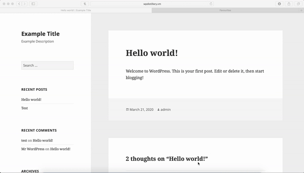
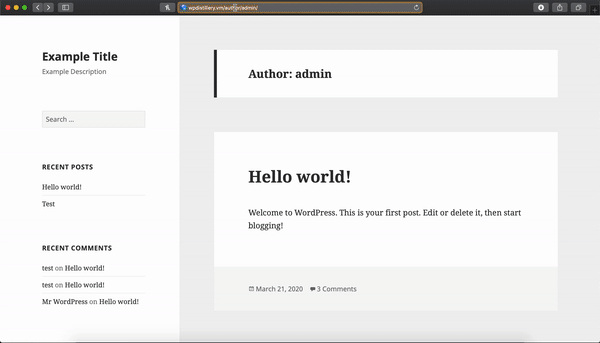
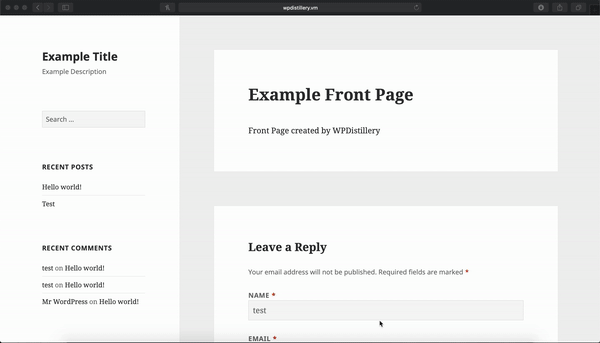

# Project 7 - WordPress Pentesting

> Objective: Discover and demonstrate proofs-of-concepts for at least three and (up to five) exploits affecting an older version of WordPress.

## Penetration Testing Report:

1. Username Enumeration by HTTP GET request
  - [ ] Summary: 
    - Vulnerability types: User Enumeration
    - Tested in version: 4.2
    - Fixed in version: N/A
    - [User Enumeration in WP](https://perishablepress.com/stop-user-enumeration-wordpress/)
  - [ ] GIF Walkthrough:
    
    
    
  - [ ] Steps to recreate:
    We try to access all the users in the database using a simple http get request by changing the values of the "author" parameter
    1. Enter ```http://wpdistillery.com?author=<author id>``` in the URL field and insert a number, which will be treated like an id.
      I used 1 as the first test param because usually 1 is assigned to the admin ```http://wpdistillery.com?author=1```
    2. You'll be redirected to ```http://wpdistillery.vm/author/<user id>/ ```
      
      In my test case, I was redirected to ```http://wpdistillery.vm/author/admin/``` hence proving that we can access any user by brute forcing the author parameter. We can do this with burp or with a simple python script.

2. Unauthenticated Stored Cross-Site Scripting (XSS)
  - [ ] Summary:
    - Vulnerability types: XSS
    - Tested in version: 4.2
    - Fixed in version: 4.2.1
    - [CVE 2015-3440](https://cve.mitre.org/cgi-bin/cvename.cgi?name=CVE-2015-3440)
    - [Exploit Database 36844](https://www.exploit-db.com/exploits/36844/)

  - [ ] GIF Walkthrough:
    
    
    
  - [ ] Steps to recreate:
    1. Find a post on the target WordPress site and make a benign comment. Something like "nice article" works.
    2. Since the comment was not spam, the admin will naturally approve it.
    3. Once the admin approves this comment, all subsequent comments won't be needed to be approved by the admin.
    4. Now, open the file: [xss.js](./code/xss.js)
    5. Copy the contents of this file and post this as a comment on any post on the WP site.
    6. Refresh the page and hover over the comment you just made. 
    7. You'll be able to see an alert which proves that there is a XSS vulnerability present.
  - [ ] Affected source code:
    - [wp-db.php](https://core.trac.wordpress.org/browser/tags/4.2/src/wp-includes/wp-db.php)
    
3. Directory Traversal
  - [ ] Summary: 
    - Vulnerability types: Information Overexposure
    - Tested in version: 4.2
    - [CVE 548](https://cwe.mitre.org/data/definitions/548.html)
    - Fixed in version: N/A
  - [ ] GIF Walkthrough:
  
    
    
  - [ ] Steps to recreate:
    1. Navigate to [/wp-admin/js](http://wpdistillery/wp-admin/js) or [/wp-admin/css](http://wpdistillery.vm/wp-admin/css/)
    2. You can view all the files on the server even though you are not an authenticated admin.
    3. Hence, any person can view the sensitive files (like the login code) and leverage that to potentially find a backdoor into the system.
  - [ ] Affected source code:
    N/A

4. User Enumeration with Login Error Messages
  - [ ] Summary: 
    - Vulnerability types: User Enumeration
    - Tested in version: 4.2
    - Fixed in version: N/A
    - [User enum in WP blogpost](https://hackertarget.com/wordpress-user-enumeration/)
    - [CVE 2009-2335](https://cve.mitre.org/cgi-bin/cvename.cgi?name=CVE-2009-2335)
  - [ ] GIF Walkthrough:
  
    
    
  - [ ] Steps to recreate:
    1. Type a known username in the username field.
    2. Guess a possible password and try to login.
    3. You will see an error message which confirms that this user exists.
    4. Repeat the steps for an unknown user (who doesn't exist) and you'll see a different error message which mentions "invalid username".
    
## Resources:

- [WordPress Developer Reference](https://developer.wordpress.org/reference/)

- GIFs created with [ezgif](http://www.ezgif.com/).

## Notes:

The exercise was performed on a macbook pro running on macOs Catalina. Licecap wasn't working properly on my laptop so I had to record my walkthroughs using Quicktime. I converted them to a gif format using the website ezgif.com with a low frame rate of 7 fps.

## Inital port scanning using Nmap & WP scanning using WPScan

### WPScan Report:


### NMap Report:


